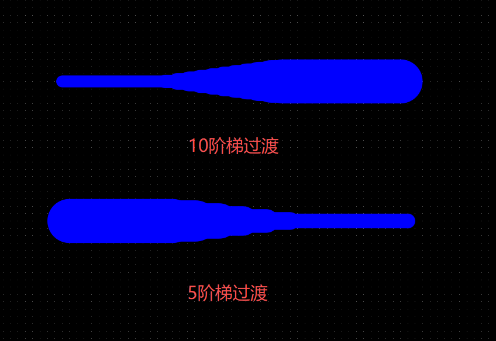

# 均匀导线过渡 (Uniform Wiring Transition)

一个用于嘉立创EDA (EasyEDA Pro) 的插件，用于在不同宽度的导线之间创建平滑的阶梯式过渡。

## 主要功能

- **阶梯过渡**: 自动在两根宽度不同的导线之间生成多段线宽渐变的导线段。
- **广泛支持**: 支持连接 **直线 (Track)** 和 **圆弧 (ArcTrack)**。
- **智能连接**: 支持框选多段导线，插件会自动识别缺口位置并进行连接。
- **双导线连接**: 选中两根导线，插件会自动识别最近的端点进行连接。
- **单位切换**: 支持 mm 和 mil 两种单位显示。
- **自定义段数**: 用户可以指定阶梯的段数 (1-50)，以控制过渡的平滑程度。

## 使用方法

1. **安装插件**: 加载本插件 (`.eext` 文件)。
2. **选择导线**: 在 PCB 编辑器中，选中需要连接的导线。
	- 支持 **直线 (Track)** 和 **圆弧 (Arc)**。
	- 支持 **框选** 多段导线。
	- 插件会自动识别“悬空端点”（没有与其他选中线段相连的端点），并在其中找到最近的一对进行连接。
3. **运行命令**: 点击顶部菜单 **均匀过渡导线** -> **创建阶梯过渡**。
4. **设置参数**:
    - 插件会显示连接点坐标及距离。
    - 在弹出的对话框中，输入想要的 **阶梯段数** (建议参考显示的建议值)。
5. **完成**: 插件将自动生成连接导线。

## 菜单选项

- **创建阶梯过渡**: 执行主要的过渡生成功能。
- **切换单位 (mm/mil)**: 在毫米和密耳之间切换插件显示的单位。
- **关于**: 显示插件版本和当前设置信息。

## 注意事项

- 支持选中 **两条或更多** 导线（支持框选），插件会自动识别悬空端点并寻找最近的连接点。
- 要连接的两个端点必须在 **同一图层**。
- 如果所有选中的导线已完全相连（无悬空端点），插件会提示无法连接。

## 效果图

---

# Uniform Wiring Transition

A plugin for EasyEDA Pro to create smooth stepped transitions between tracks of different widths.

## Features

- **Stepped Transition**: Automatically generates multiple segments with incremental width changes between two tracks.
- **Broad Support**: Supports transitions between **Straight Tracks** and **Arcs (ArcTrack)**.
- **Smart Selection**: You can select multiple segments (box select), and the plugin will automatically detect and bridge the gap.
- **Gap Bridging**: Automatically identifies the closest endpoints between selected wiring chains.
- **Unit Switching**: Supports display in both mm and mil.
- **Custom Segment Count**: Users can specify the number of stepped segments (1-50) to control smoothness.

## Usage

1. **Install Plugin**: Load this plugin (`.eext` file).
2. **Select Tracks**: In the PCB editor, select the tracks you want to connect.
    - Supports **Tracks** and **Arcs**.
    - Supports **Box Selection** of multiple segments.
    - The plugin automatically identifies 'dangling endpoints' (endpoints not connected to other selected segments) and finds the closest pair.
3. **Run Command**: Click top menu **均匀过渡导线** -> **创建阶梯过渡**.
4. **Configure**:
    - The plugin displays connection point coordinates and distance.
    - In the popup dialog, enter the desired **Segment Count** (refer to the suggested value).
5. **Done**: The plugin will generate the connecting tracks.

## Menu Options

- **Create Stepped Transition**: Execute the main transition function.
- **Toggle Unit (mm/mil)**: Switch display units between millimeters and mils.
- **About**: Show plugin version and current settings.

## Notes

- You can select **two or more** tracks (including box selection); the plugin finds dangling endpoints and connects the closest pair.
- Both endpoints to be connected must be on the **same layer**.
- If all selected tracks are fully connected (no dangling endpoints), the plugin will notify you.

## Rendering

